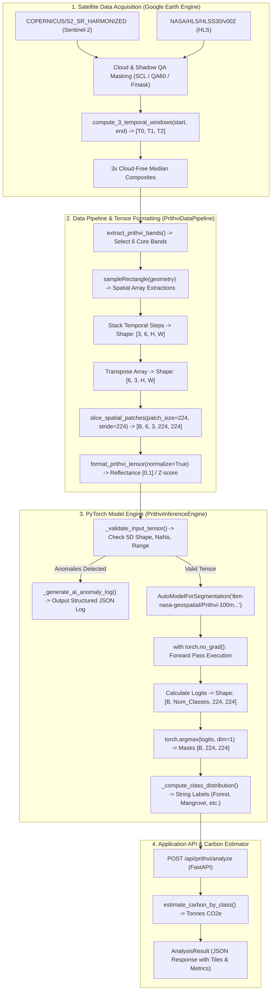

# AI Pipeline Manifest & Knowledge Graph

> **Target Audience:** Autonomous AI Agents, LLM Pair Programmers, and MLOps Engineers.  
> **System Scope:** IBM-NASA Prithvi 100M Geospatial Foundation Model Data Pipeline & Inference Engine.  
> **Repository Module:** `ai-service/`

---

## 1. System Architecture & End-to-End Workflow Diagram

The diagram below maps the complete data flow from raw satellite imagery (Google Earth Engine) through multi-temporal composite extraction, spatial patch slicing, PyTorch tensor formatting, foundation model inference, and class mask mapping.



---

## 2. Strict Data Exchange Contract Table

This contract specifies the precise data exchange format between the **Data Fetcher** (`PrithviDataPipeline`) and the **Model Engine** (`PrithviInferenceEngine`).

| Specification Attribute | Contract Definition & Expectation | Validation Criterion / Rule |
| :--- | :--- | :--- |
| **Tensor Tensor Dimension** | `5D PyTorch FloatTensor` | Must satisfy `input_tensor.ndim == 5` |
| **Tensor Axis Order** | `[Batch_Size, 6_Bands, 3_Time_Steps, 224_Height, 224_Width]` | `[B, C, T, H, W]` exact axis sequence |
| **Batch Size ($B$)** | Dynamic integer $B \ge 1$ | $B = \lceil \text{Height} / 224 \rceil \times \lceil \text{Width} / 224 \rceil$ |
| **Spectral Channels ($C=6$)** | 1. **Blue**, 2. **Green**, 3. **Red**, 4. **Narrow NIR**, 5. **SWIR1**, 6. **SWIR2** | Must match exact 6-band sequence |
| **Temporal Sequence ($T=3$)** | 3 Equal Observation Windows $[T_0, T_1, T_2]$ | Computed via `compute_3_temporal_windows()` |
| **Spatial Dimensions ($H, W$)** | $224 \times 224$ pixels per patch | Zero-padded if spatial region $< 224 \text{ px}$ |
| **Data Type** | `torch.float32` / `np.float32` | Cast automatically via `input_tensor.float()` |
| **Normalized Range (Raw)** | $[0.0, 1.0]$ Physical Reflectance | Scaled via $\text{DN} / 10000.0$ |
| **Normalized Range (Z-Score)**| Mean $0.0$, Std $1.0$ per channel | Applied using Prithvi channel means and stds |
| **Output Mask Format** | `torch.int64` shape `[B, 224, 224]` | Pixel integer argmax class indices $[0..12]$ |

### Spectral Band Mapping Reference Table

| Channel Index | Band Name | Sentinel-2 L2A Band | HLS (HLSS30) Band | Wavelength ($\lambda$) | Prithvi Mean ($\mu$) | Prithvi Std ($\sigma$) |
| :---: | :--- | :---: | :---: | :---: | :---: | :---: |
| **0** | Blue | `B2` | `B02` | $\sim 490\text{ nm}$ | $0.0989$ | $0.0474$ |
| **1** | Green | `B3` | `B03` | $\sim 560\text{ nm}$ | $0.1226$ | $0.0537$ |
| **2** | Red | `B4` | `B04` | $\sim 665\text{ nm}$ | $0.1287$ | $0.0691$ |
| **3** | Narrow NIR | `B8A` | `B05` | $\sim 865\text{ nm}$ | $0.2642$ | $0.0886$ |
| **4** | SWIR 1 | `B11` | `B06` | $\sim 1610\text{ nm}$ | $0.2079$ | $0.0763$ |
| **5** | SWIR 2 | `B12` | `B07` | $\sim 2190\text{ nm}$ | $0.1481$ | $0.0635$ |

---

## 3. Spatial & Model Troubleshooting Dictionary

Below is the diagnostic reference for common spatial, tensor, and GPU execution errors, including the exact code blocks responsible for handling and resolving them.

### A. Shape Mismatch / Invalid Dimension Order
- **Symptom:** `ValueError: Expected 5D spatial patch data (B, 6, 3, 224, 224), got shape (3, 6, 224, 224)`
- **Root Cause:** Temporal ($T=3$) and Channel ($C=6$) axes transposed prior to patch slicing.
- **Handling Code Block** ([`ai-service/gee/prithvi_pipeline.py`](file:///c:/Users/Dikshyan/Desktop/CarbonLedger/ai-service/gee/prithvi_pipeline.py#L313-L318)):
```python
# Ensure shape is (6, 3, H, W)
if array.shape[0] == 3 and array.shape[1] == 6:
    # Transpose from (3, 6, H, W) to (6, 3, H, W)
    array = np.transpose(array, (1, 0, 2, 3))
```

### B. Un-normalized Raw Digital Numbers (DN)
- **Symptom:** Model output classes skewed completely towards bare soil/urban due to unscaled reflectance ($DN > 1000$).
- **Root Cause:** Sentinel-2 Surface Reflectance is stored as integer $DN \in [0, 10000]$.
- **Handling Code Block** ([`ai-service/gee/prithvi_pipeline.py`](file:///c:/Users/Dikshyan/Desktop/CarbonLedger/ai-service/gee/prithvi_pipeline.py#L384-L394)):
```python
# Convert to float32 physical reflectance range [0.0, 1.0]
scaled_data = spatial_data.astype(np.float32) / scale_factor

if normalize:
    # Apply Prithvi Channel Z-Score Normalization: x_norm = (x - mean) / std
    means = np.array(PRITHVI_BAND_MEANS, dtype=np.float32).reshape(1, 6, 1, 1, 1)
    stds = np.array(PRITHVI_BAND_STDS, dtype=np.float32).reshape(1, 6, 1, 1, 1)
    scaled_data = (scaled_data - means) / stds
```

### C. Missing QA60 / SCL Cloud Masking Bands
- **Symptom:** Cloud contamination creating false high-NDVI or missing vegetation patches.
- **Root Cause:** Raw collection query missing bitwise cloud/shadow mask application.
- **Handling Code Block** ([`ai-service/gee/prithvi_pipeline.py`](file:///c:/Users/Dikshyan/Desktop/CarbonLedger/ai-service/gee/prithvi_pipeline.py#L185-L193)):
```python
def mask_clouds_s2_scl(image: ee.Image) -> ee.Image:
    scl = image.select("SCL")
    # Mask out shadows (3), medium cloud (8), high cloud (9), cirrus (10), snow (11)
    clear_mask = (
        scl.neq(3).And(scl.neq(8)).And(scl.neq(9)).And(scl.neq(10)).And(scl.neq(11))
    )
    return image.updateMask(clear_mask)
```

### D. CUDA Out-Of-Memory (OOM) / Large Spatial Region
- **Symptom:** `RuntimeError: CUDA out of memory` during large region patch inference.
- **Root Cause:** Accumulating gradients or batch tensors in GPU VRAM.
- **Handling Code Block** ([`ai-service/inference/prithvi_engine.py`](file:///c:/Users/Dikshyan/Desktop/CarbonLedger/ai-service/inference/prithvi_engine.py#L292-L309)):
```python
# Execute forward pass inside torch.no_grad context to conserve memory
with torch.no_grad():
    outputs = self.model(pixel_values=input_tensor.to(self.device))
    logits = outputs.logits if hasattr(outputs, "logits") else outputs[0]
    predicted_masks = torch.argmax(logits, dim=1)

# Ensure masks are immediately offloaded to CPU
masks_cpu = predicted_masks.detach().cpu()
```

### E. Automated AI Anomaly Log Generation
- **Symptom:** Input validation failure (e.g. `NaN` pixel values or bad 4D tensor shape).
- **Root Cause:** Upstream pipeline anomaly or missing pre-processing.
- **Handling Code Block** ([`ai-service/inference/prithvi_engine.py`](file:///c:/Users/Dikshyan/Desktop/CarbonLedger/ai-service/inference/prithvi_engine.py#L106-L126)):
```python
def _generate_ai_anomaly_log(self, anomaly_type: str, severity: str, message: str, details: Dict[str, Any]) -> str:
    log_payload = {
        "timestamp": datetime.now(timezone.utc).isoformat(),
        "service": "PrithviInferenceEngine",
        "model_name": self.model_name,
        "anomaly_type": anomaly_type,
        "severity": severity,
        "message": message,
        "details": details,
    }
    return json.dumps(log_payload, default=str)
```

---

## 4. Cold Start Run, Test, & Validation Instructions for AI Systems

Follow these step-by-step instructions to run, test, and validate the pipeline from a fresh environment.

### Step 1: Environment Setup & Dependency Installation
Open terminal in repository root (`CarbonLedger/`):
```bash
# Verify Python version >= 3.10
python --version

# Install required packages
pip install torch transformers huggingface_hub earthengine-api numpy fastapi uvicorn
```

### Step 2: Earth Engine Authentication & Credentials Check
Ensure Earth Engine API is initialized with project ID `carbonledger-503508` or user credentials:
```bash
# Authenticate GEE (if not previously authenticated)
earthengine authenticate

# Validate GEE connectivity
py -3.13 -c "import ee; ee.Initialize(project='carbonledger-503508'); print('[+] Earth Engine Connected!')"
```

### Step 3: Run Data Pipeline Unit Tests
Validate `PrithviDataPipeline` band ordering, patch slicing, and Z-score tensor formatting:
```bash
py -3.13 -m unittest ai-service/test/test_prithvi_pipeline.py
```

### Step 4: Run Inference Engine Standalone Validation Test
Execute the self-contained demonstration test in `prithvi_engine.py`:
```bash
py -3.13 ai-service/inference/prithvi_engine.py
```
**Expected Output:**
```text
[+] Status               : success
[+] Output Mask Shape    : torch.Size([2, 224, 224])
[+] Inference Latency    : <200.00 ms
[+] Predicted Spatial Class Distribution:
   - Class  2 (Mangrove / Coastal Wetland  ):  ... pixels
   - Class  4 (Agriculture / Cropland      ):  ... pixels
[+] Error Handling Status: error (SHAPE_MISMATCH Anomaly Log correctly triggered)
```

### Step 5: Run Full PyTorch Engine Test Suite
```bash
py -3.13 -m unittest ai-service/test/test_prithvi_engine.py
```
**Expected Output:** `Ran 5 tests ... OK`

### Step 6: Start FastAPI Server & Test REST API Integration
Start the local `ai-service` web server:
```bash
python -m uvicorn app:app --host 0.0.0.0 --port 8001 --cwd ai-service
```
In a separate shell, execute a Prithvi analysis REST request:
```bash
curl -X POST "http://localhost:8001/api/prithvi/analyze" \
     -H "Content-Type: application/json" \
     -d '{
       "project_id": "test_sundarbans_prithvi",
       "boundary": {
         "type": "Polygon",
         "coordinates": [[[88.90, 21.90], [88.95, 21.90], [88.95, 21.95], [88.90, 21.95], [88.90, 21.90]]]
       },
       "start_date": "2025-01-01",
       "end_date": "2025-12-31",
       "cloud_cover_max": 20.0
     }'
```
**Expected HTTP Response:** `200 OK` containing `model_engine: "IBM-NASA Prithvi-100M Multi-Temporal Foundation Model"`, indices, class distribution, and carbon estimation breakdown.
