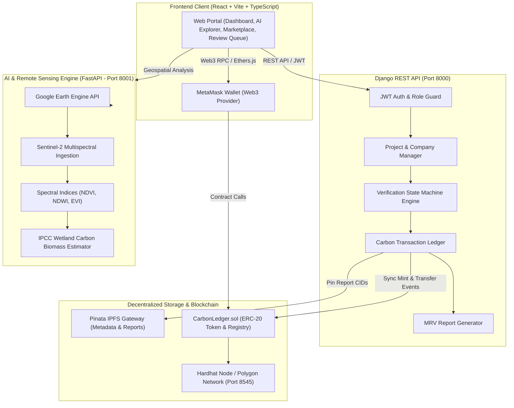
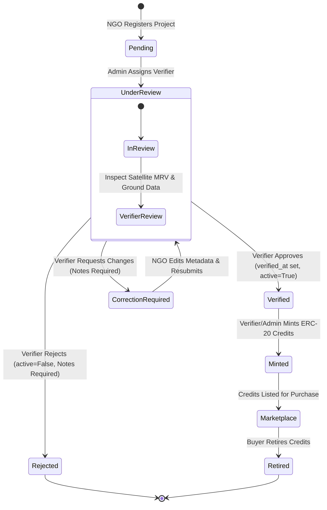

# 🌱 BlueChain — Blue Carbon MRV & Tokenized Decentralized Registry

[](https://react.dev/)
[](https://www.djangoproject.com/)
[](https://fastapi.tiangolo.com/)
[](https://soliditylang.org/)
[](https://pinata.cloud/)
[](https://www.typescriptlang.org/)
[](https://opensource.org/licenses/MIT)

> **Developed for the Smart India Hackathon (SIH)**  
> **BlueChain** is an end-to-end, blockchain-powered **Blue Carbon Monitoring, Reporting, and Verification (MRV)** platform. It combines satellite Earth observation (Sentinel-2 via Google Earth Engine), automated IPCC carbon sequestration modeling, an immutable verification workflow, and on-chain tokenization on Polygon to eliminate greenwashing and accelerate coastal restoration finance.

---

## 📑 Table of Contents

- [Problem Statement & Solution](#-problem-statement--solution)
- [Key Features](#-key-features)
- [System Architecture](#-system-architecture)
- [Project Verification Workflow](#-project-verification-workflow)
- [Tech Stack](#-tech-stack)
- [Repository Structure](#-repository-structure)
- [Getting Started & Installation](#-getting-started--installation)
  - [Prerequisites](#prerequisites)
  - [1. Backend Setup (Django REST Framework)](#1-backend-setup-django-rest-framework)
  - [2. AI Service Setup (FastAPI + Google Earth Engine)](#2-ai-service-setup-fastapi--google-earth-engine)
  - [3. Blockchain Setup (Hardhat & Smart Contracts)](#3-blockchain-setup-hardhat--smart-contracts)
  - [4. Frontend Setup (React + Vite)](#4-frontend-setup-react--vite)
- [Environment Configuration](#-environment-configuration)
- [API Reference](#-api-reference)
- [Role-Based Access Control (RBAC) Matrix](#-role-based-access-control-rbac-matrix)
- [Testing & Quality Assurance](#-testing--quality-assurance)
- [Contributing & Team](#-contributing--team)

---

## 🌊 Problem Statement & Solution

### The Challenge
- **High Sequestration Potential:** Coastal ecosystems (mangroves, tidal marshes, and seagrass beds) sequester carbon up to **10× faster** and store up to **5× more carbon per hectare** than terrestrial tropical rainforests.
- **Flawed Traditional MRV:** Manual ecological field audits take **12 to 18 months**, cost tens of thousands of dollars, lack transparency, and rely on static paper reports vulnerable to data manipulation, greenwashing, and double-counting.
- **Market Liquidity Bottleneck:** Small restoration NGOs struggle to access global carbon markets, while enterprise buyers face severe transparency and authenticity risks.

### The BlueChain Solution
1. **Automated Satellite MRV:** Analyzes multi-spectral Sentinel-2 satellite imagery through Google Earth Engine (GEE) to calculate NDVI, classify mangrove canopy density, and compute biomass sequestration using IPCC Wetlands Supplement standards.
2. **Transparent 4-Stage Governance:** Robust role-based verification lifecycle ensuring strict separation of powers between NGOs, Independent Verifiers, Platform Admins, and Buyers.
3. **Decentralized Audit Trail:** Verified ecological reports and transaction receipts are pinned to **IPFS (via Pinata)** with cryptographic CID hashes permanently anchored to the **Polygon** blockchain.
4. **Tokenized Carbon Credit Marketplace:** Direct on-chain minting of verified credits into ERC-20 tokens, enabling real-time purchasing, wallet-to-wallet transfers, and irrevocable retirement to prevent double-spending.

---

## ✨ Key Features

| Capability | Description |
|---|---|
| 🛰️ **AI Explorer & Geospatial Mapping** | Interactive Leaflet-powered satellite map with polygon boundary drawing, real-time vegetation indices (NDVI, NDWI, EVI, MNDWI), and automatic carbon potential estimation. |
| 🛡️ **Role-Based Access Control (RBAC)** | Dedicated portal views and permissions for **Admin**, **Government Official (Verifier)**, **NGO Representative**, and **Company Buyer**. |
| 📋 **Full Lifecycle Project State Machine** | Complete review state transitions (`Pending` ➔ `Under Review` ➔ `Correction Required` ➔ `Verified` or `Rejected`) with full verifier feedback integration. |
| 🔄 **NGO Edit & Resubmit Workflow** | When corrections are requested, NGOs review the verifier's feedback, update permitted project metadata, and resubmit directly back to the assigned verifier without losing assignment context. |
| 🔒 **Tamper-Proof Protected Fields** | Critical fields (`status`, `assigned_verifier`, `verifier_notes`, `verified_at`, `active`, `created_by`) are strictly protected at the API level against unauthorized direct modifications. |
| ⛓️ **Web3 Carbon Credit Minting** | Verified projects can be minted directly onto Polygon Amoy / local Hardhat EVM contracts by authorized verifiers or admins. |
| 🛒 **Carbon Credit Marketplace** | Public registry browsing, live credit pricing, MetaMask wallet integration, credit purchase execution, and permanent token retirement. |
| 📊 **Dynamic Analytical Dashboards** | Role-tailored dashboard statistics, real-time credit issuance summaries, project state breakdowns, and PDF MRV report downloads. |

---

## 🏛️ System Architecture



---

## 🔄 Project Verification Workflow

The verification pipeline enforces a strict state machine across all roles:



---

## 🛠️ Tech Stack

### Frontend
- **Framework:** React 19, Vite, TypeScript
- **Styling & UI:** Tailwind CSS, Radix UI primitives, Lucide Icons, Framer Motion
- **Routing & State:** Wouter, React Context API
- **Web3 & Maps:** Ethers.js v6, Leaflet, Turf.js, Chart.js

### Backend API
- **Framework:** Django 5.x, Django REST Framework (DRF)
- **Authentication:** `djangorestframework-simplejwt` (JWT Access & Refresh Tokens)
- **Database:** SQLite (default / dev) / PostgreSQL / MongoDB
- **CORS & Middleware:** `django-cors-headers`

### AI & Satellite Remote Sensing
- **Framework:** FastAPI, Uvicorn, Python 3.10+
- **Earth Observation:** Google Earth Engine (`earthengine-api`), Copernicus Sentinel-2 Level-2A
- **Scientific Computing:** NumPy, Pandas, Scikit-learn, GeoPandas, Shapely, Rasterio

### Blockchain & Decentralized Storage
- **Smart Contracts:** Solidity `^0.8.20`, OpenZeppelin Contracts
- **Development Tooling:** Hardhat, Ethers.js, Node.js
- **Network Targets:** Local Hardhat EVM Node, Polygon Amoy Testnet, Polygon Mainnet
- **Decentralized Storage:** Pinata IPFS (JSON metadata & MRV audit pinning)

---

## 📂 Repository Structure

```
BlueChain/
├── ai-service/                  # FastAPI Remote Sensing & Carbon Modeling Service
│   ├── api/                     # REST API routers & schemas
│   │   └── routes.py            # Point & polygon analysis endpoints
│   ├── carbon/                  # IPCC carbon density & biomass calculators
│   ├── gee/                     # Google Earth Engine Sentinel-2 connectors
│   ├── models/                  # Pydantic request & response models
│   ├── ndvi/                    # Spectral index calculators (NDVI, NDWI, EVI, MNDWI)
│   ├── app.py                   # FastAPI application initialization & GEE startup
│   └── requirements.txt         # AI service Python dependencies
│
├── backend/                     # Django REST Framework Central API
│   ├── api/                     # Main BlueChain application
│   │   ├── migrations/          # Database schema migrations
│   │   ├── models.py            # Company, User/Profile, CarbonTransaction, PricingConfig
│   │   ├── serializers.py       # DRF serializers & validation rules
│   │   ├── views.py             # ViewSets, review actions, resubmit, & minting views
│   │   ├── urls.py              # Sub-router API endpoint mapping
│   │   ├── permissions.py       # RBAC role permissions
│   │   └── pinata.py            # IPFS pinning client & fallback handler
│   ├── clapi/                   # Django project configuration & settings
│   │   ├── settings.py          # App settings, DB config, JWT & CORS setup
│   │   └── urls.py              # Root URL router (/api/v1/)
│   ├── manage.py                # Django CLI entrypoint
│   └── requirements.txt         # Backend Python dependencies
│
├── blockchain/                  # Hardhat EVM & Smart Contract Environment
│   ├── contracts/               # Solidity smart contracts
│   │   └── CarbonLedger.sol     # ERC-20 token, registry, & verification contract
│   ├── scripts/                 # Deployment and transaction scripts
│   │   ├── deploy.js            # Contract deployment script
│   │   ├── mintCreditsAmoy.js   # Credit minting script
│   │   └── transferCreditsAmoy.js
│   ├── hardhat.config.ts        # Hardhat configuration (Solidity compiler & networks)
│   └── package.json             # Blockchain development dependencies
│
├── frontend/                    # React 19 + Vite Frontend Application
│   ├── src/
│   │   ├── components/          # Reusable UI components
│   │   │   ├── Header.tsx       # Navigation bar with role-based routing
│   │   │   ├── ProtectedRoute.tsx # Route security & RBAC guard
│   │   │   ├── StatusBadge.tsx  # Color-coded workflow badge component
│   │   │   ├── NGOEditResubmitModal.tsx # NGO metadata correction modal
│   │   │   ├── VerifierReviewModal.tsx  # Verifier approval/rejection modal
│   │   │   └── ui/              # Radix UI library components
│   │   ├── contexts/            # React AuthContext (JWT session management)
│   │   ├── lib/                 # API client utilities (apiFetch, token handling)
│   │   ├── pages/               # Main application views
│   │   │   ├── LandingPage.tsx  # Hero landing page
│   │   │   ├── Dashboard.tsx    # Role-tailored dashboard
│   │   │   ├── AdminDashboard.tsx # Admin verifier assignment & user management
│   │   │   ├── VerifierDashboard.tsx # Independent verification queue
│   │   │   ├── Marketplace.tsx  # Carbon credit marketplace & purchasing
│   │   │   ├── AiExplorer.tsx   # Geospatial satellite map analysis
│   │   │   ├── ProjectRegistration.tsx # NGO project onboarding
│   │   │   ├── Profile.tsx      # User profile, wallet, & project list
│   │   │   ├── Login.tsx        # Authentication entry
│   │   │   └── Register.tsx     # Public registration page
│   │   ├── App.tsx              # Main application router
│   │   └── main.tsx             # React DOM entrypoint
│   ├── package.json             # Frontend dependencies
│   └── vite.config.ts           # Vite build & proxy settings
│
├── docs/                        # Architecture & API documentation
├── .env.example                 # Environment variable templates
├── pnpm-workspace.yaml          # PNPM monorepo workspace definition
└── README.md                    # Project documentation
```

---

## 🚀 Getting Started & Installation

### Prerequisites
- **Node.js** `v18.0.0+` or `v20.0.0+`
- **pnpm** `v9.0.0+` (Run `npm install -g pnpm`)
- **Python** `3.10+` or `3.12+`
- **Git**
- **MetaMask Browser Extension** (for Web3 features)

---

### 1. Backend Setup (Django REST Framework)

```bash
# Navigate to the backend directory
cd backend

# Create and activate a Python virtual environment
python -m venv .venv

# On Windows (PowerShell):
.\.venv\Scripts\Activate.ps1
# On Linux/macOS:
source .venv/bin/activate

# Install required dependencies
pip install -r requirements.txt

# Run migrations to initialize SQLite/PostgreSQL
python manage.py migrate

# (Optional) Create a superuser for Django admin
python manage.py createsuperuser

# Start the Django development server (runs on port 8000)
python manage.py runserver 8000
```

---

### 2. AI Service Setup (FastAPI + Google Earth Engine)

```bash
# Open a new terminal and navigate to ai-service
cd ai-service

# Create and activate virtual environment
python -m venv .venv

# On Windows (PowerShell):
.\.venv\Scripts\Activate.ps1
# On Linux/macOS:
source .venv/bin/activate

# Install dependencies
pip install -r requirements.txt

# (Optional) Authenticate with Google Earth Engine
earthengine authenticate

# Start the FastAPI AI service (runs on port 8001)
uvicorn app:app --host 127.0.0.1 --port 8001 --reload
```
> *Note: If Google Earth Engine credentials are not configured, the service automatically runs in high-fidelity IPCC fallback mode for local testing without breaking any frontend workflows.*

---

### 3. Blockchain Setup (Hardhat & Smart Contracts)

```bash
# Open a new terminal and navigate to blockchain
cd blockchain

# Install blockchain dependencies
pnpm install

# Start a local Hardhat Ethereum node (runs on port 8545)
pnpm hardhat node
```

In a separate terminal, deploy the `CarbonLedger.sol` contract to the local network:

```bash
cd blockchain
pnpm hardhat run scripts/deploy.js --network localhost
```
*Copy the deployed contract address and add it to your `.env` files.*

---

### 4. Frontend Setup (React + Vite)

```bash
# Open a new terminal and navigate to frontend
cd frontend

# Install frontend dependencies
pnpm install

# Start the Vite development server (runs on http://localhost:5173)
pnpm dev
```

Open your browser and navigate to **`http://localhost:5173`**.

---

## ⚙️ Environment Configuration

Copy the example environment configurations to their respective directories:

### Backend (`backend/.env`)
```ini
DEBUG=True
SECRET_KEY=your-django-secret-key-here
ALLOWED_HOSTS=localhost,127.0.0.1
WEB3_PROVIDER_URL=http://127.0.0.1:8545
CONTRACT_ADDRESS=0x5FbDB2315678afecb367f032d93F642f64180aa3
PINATA_API_KEY=your-pinata-api-key
PINATA_SECRET_API_KEY=your-pinata-secret-key
PINATA_JWT=your-pinata-jwt-token
AI_SERVICE_URL=http://127.0.0.1:8001
```

### AI Service (`ai-service/.env`)
```ini
GEE_PROJECT_ID=carbonledger-503508
GOOGLE_APPLICATION_CREDENTIALS=./auth/gee-credentials.json
MAPBOX_ACCESS_TOKEN=your-mapbox-token
```

### Frontend (`frontend/.env`)
```ini
VITE_API_URL=http://127.0.0.1:8000/api/v1
VITE_AI_SERVICE_URL=http://127.0.0.1:8001
VITE_BLOCKCHAIN_RPC=http://127.0.0.1:8545
VITE_CONTRACT_ADDRESS=0x5FbDB2315678afecb367f032d93F642f64180aa3
```

---

## 📡 API Reference

All backend endpoints are prefixed with `/api/v1/`:

### 🔐 Authentication & Session
- `POST /api/v1/register/` — Register a new account (`NGO Representative` or `Company Buyer`).
- `POST /api/token/` — Obtain JWT access and refresh tokens.
- `POST /api/token/refresh/` — Refresh expired JWT access token.
- `GET /api/v1/me/` — Retrieve the currently authenticated profile and assigned role.

### 🌿 Projects & MRV Registry
- `GET /api/v1/CarbonLedger/` — List projects (scoped by role for NGOs/Buyers; platform-wide for Admin/Verifier; verified only for public marketplace).
- `POST /api/v1/CarbonLedger/` — Register a new blue carbon project (NGO only; initial status `Pending`).
- `GET /api/v1/CarbonLedger/<id>/` — Retrieve detailed project metadata and verifier feedback notes.
- `PATCH /api/v1/CarbonLedger/<id>/` — Update permitted project metadata (protected fields blocked).
- `GET /api/v1/CarbonLedger/<id>/report/` — Download generated PDF MRV report.

### 🛡️ Administrative & Verifier Actions
- `GET /api/v1/admin/users/` — List and create platform users (Admin only).
- `POST /api/v1/admin/projects/<id>/assign-verifier/` — Assign a Government Official to a `Pending` project (transitions to `Under Review`).
- `POST /api/v1/projects/<id>/review/` — Submit verifier review (`action: "approve" | "request_correction" | "reject"`, with mandatory `notes`).
- `POST /api/v1/projects/<id>/resubmit/` — NGO resubmission of a `Correction Required` project (transitions to `Under Review`).
- `POST /api/v1/company/<id>/mint/` — Mint on-chain carbon credits for a `Verified` project (assigned Verifier or Admin only).

### 🛒 Marketplace & Ledger
- `GET /api/v1/pricing/` — Get or update carbon credit benchmark price configuration.
- `POST /api/v1/CarbonLedgerTransactions/` — Execute a credit purchase (`transaction_type: "Recieve"`) or retirement.
- `GET /api/v1/dashboard-stats/` — Real-time analytical statistics aggregated by user role.

### 🛰️ AI Remote Sensing Service (Port 8001)
- `GET /health` — Service status and Earth Engine connection state.
- `POST /api/v1/analyze/point` — Point coordinate satellite analysis (NDVI mean, canopy cover %, carbon tonnes).
- `POST /api/v1/analyze` — GeoJSON polygon boundary analysis and spatial carbon heatmaps.

---

## 👥 Role-Based Access Control (RBAC) Matrix

| Feature / Action | Admin | Government Official (Verifier) | NGO Representative | Company Buyer | Public (Guest) |
|---|:---:|:---:|:---:|:---:|:---:|
| **Browse Marketplace** | ✅ | ✅ | ✅ | ✅ | ✅ |
| **Use AI Explorer** | ✅ | ✅ | ✅ | ✅ | ✅ |
| **Register New Project** | ❌ | ❌ | ✅ | ❌ | ❌ |
| **Edit Project Metadata** | ✅ (All) | ❌ | ✅ (Own Only) | ❌ | ❌ |
| **Assign Verifier** | ✅ | ❌ | ❌ | ❌ | ❌ |
| **Review Project (Approve / Reject / Correction)** | ✅ | ✅ (Assigned Only) | ❌ | ❌ | ❌ |
| **Resubmit Project (`Correction Required`)** | ❌ | ❌ | ✅ (Own Only) | ❌ | ❌ |
| **Direct Status Override (PATCH)** | ❌ (Blocked) | ❌ (Blocked) | ❌ (Blocked) | ❌ (Blocked) | ❌ (Blocked) |
| **Mint Carbon Credits** | ✅ | ✅ (Assigned Only) | ❌ | ❌ | ❌ |
| **Purchase Carbon Credits** | ❌ | ❌ | ❌ | ✅ | ❌ |
| **Access `/admin` Dashboard** | ✅ | ❌ | ❌ | ❌ | ❌ |
| **Access `/verifier` Review Queue** | ❌ | ✅ | ❌ | ❌ | ❌ |

---

## 🧪 Testing & Quality Assurance

The codebase includes comprehensive static analysis and automated verification suites:

### 1. Backend Validation
```bash
cd backend
# Check system models and dependencies
python manage.py check

# Verify database migrations integrity
python manage.py makemigrations --check
python manage.py migrate --plan
```

### 2. Frontend Validation
```bash
cd frontend
# TypeScript static type check (0 errors)
pnpm tsc --noEmit

# Production bundle build test
pnpm build
```

### 3. Smart Contract Verification
```bash
cd blockchain
# Compile Solidity contracts
pnpm hardhat compile

# Run Hardhat test suite
pnpm hardhat test
```

---

## 🤝 Contributing & Team

Developed with pride for the **Smart India Hackathon (SIH)**.

### Development Guidelines
- Always branch from `develop` (`git checkout -b feature/your-feature-name`).
- Strictly adhere to role security rules: never bypass backend permissions for convenience.
- Ensure all TypeScript types pass (`pnpm tsc --noEmit`) before opening a pull request.
- Never commit secret keys, private keys, or `.env` files to git.

---

## 📜 License

This project is licensed under the **MIT License** — see the [LICENSE](LICENSE) file for details.